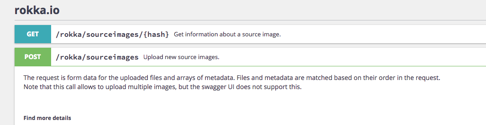

# rokka.io - ApiPlatform Bridge

**THIS IS ALPHA SOFTWARE WITHOUT ANY TESTS, UNSTABLE AND A POC, DO NOT USE IN PRODUCTION! YOU HAVE BEEN WARNED!**

Seamlessly integrates your [rokka.io][1] account with [ApiPlatform][2].



## Why?

Why would you bridge an API that is already an API?
These are the main reasons:

* Using the bundle, you can hide the API key of rokka.io behind your already existing API.
* You can use the same authentication mechanism that already protects your API to also protect rokka.io image handling.
* It automatically updates the Swagger docs of your API based on the docs of rokka.io so it's always up to date.
* It brings a consistent feeling to the developers using your API.

It works by simply bridging all the requests you make to your API to rokka.io by using the same path and enhancing it
with the authorization header for rokka.io. By default it does that using the `/rokka` bridge endpoint but this can be
configured.

Example: Let's say you want to create a new source image. In rokka.io that would be a `POST` request to
`/sourceimages/{organization}`.
So instead of sending a `POST` request to `https://api.rokka.io/sourceimages/{organization}` you would send
a `POST` request to `https://myapi.com/rokka/sourceimages/{organization}`.

Because you never want to expose the whole API for rokka.io (otherwise one could also modify your account),
the allowed endpoints have to be configured (see `Configuration` section). Thus you can bridge any endpoint you like.
The cool thing with this concept is that if you wanted to allow some users to modify your account, you can enable this
endpoint and protect it using your authentication mechanisms very easily.

Also, you can omit the whole `{organization}` part by configuring a `default_organization`, it will automatically
use this one whenever you request anything.

## Installation

1. Use [Composer][3] and run
    
    ```
    $ composer require terminal42/rokka-io-api-platform-bridge
    ```
    
    **Important:** This bundle uses [HTTPlug][5] to decouple from any specific HTTP client.
    This means that if you already use one of the available clients, it will simply re-use this one.
    If you haven't got any client yet, you have to choose one and install these first (or at the same time).
    E.g. if you want to use `Guzzle`, install the bundle like so:
    
    ```
    $ composer require terminal42/rokka-io-api-platform-bridge guzzlehttp/psr7 php-http/guzzle6-adapter php-http/message
    ``` 

2. Configure the [rokka.io Symfony Bundle as documented in their docs][4].
3. Load the bundles in your kernel which is done automatically if you use Symfony Flex, otherwise use

    ```php
    $bundles = [
        ...
        new Rokka\RokkaClientBundle\RokkaClientBundle(),
        new Terminal42\RokkaApiPlatformBridge\RokkaApiPlatformBridgeBundle(),
    ];
    ```
    
4. Add the route loader of this bundle to your routing configuration:

    ```yaml
    # config/routes.yaml (or if you're still on SF 3: app/routing.yml)
    rokka_api_platform_bridge:
        resource: .
        type: rokka_api_platform_bridge
    ```

5. Configure this bundle as shown in the `Configuration` section.

## Configuration

```yaml
rokka_api_platform_bridge:
    api_key: '' # Required
    bridge_endpoint: '/images' # Default: '/rokka'
    default_organization: ~ # Default: null
    endpoints:
        - { path: '/sourceimages/{organization}', methods: ['POST'] }
        - // etc.
```

## Roadmap / Ideas

* See how it goes :-D
* Unit tests once the concept works out
* Thumbnail endpoint to hide the rokka.io URL?
* Your ideas?

[1]: https://rokka.io/
[2]: https://api-platform.com/
[3]: https://getcomposer.org/
[4]: https://github.com/rokka-io/rokka-client-bundle#configuration
[5]: http://httplug.io/
